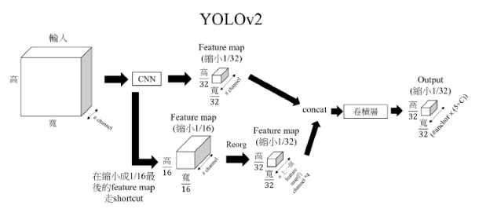
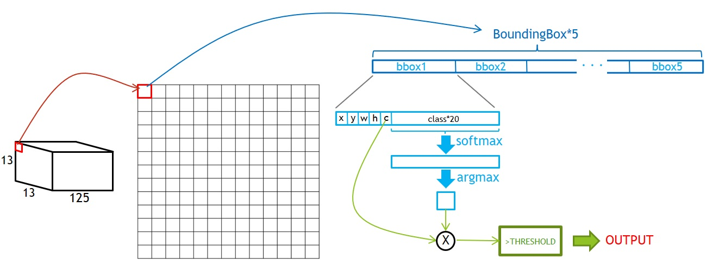
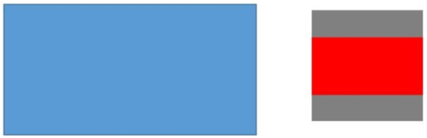

# YOLOv2
## YOLOv2 架構
  
- YOLOv2 downscaling 5 次，因此輸出 cell 數為 13x13 (416/2^5=13)，每一個 cell 大小為 32x32
### 輸入
- input size：416x416x3
### 輸出
每一個 bounding box 包含 (x, y, w, h, confidence, classes) x AnchorNum
- x, y：bounding box 的中心座標
- w, h：bounding box 的寬與長
- confidence：bounding box 信心指數
- classes：各個類別的準確率
- AnchorNum：anchor 數量，YOLOv2 為 5  
因此 output 為 13 x 13 x [(5+classes)x5]
## Bounding Box
  
此處假設共有 20 個 class，因此輸出為 13x13x125  
每一個 cell 可以取得 5 個不同大小的 bounding box，若其 confidence 乘上 class 的準確率(最大的那一個)大於 threshold 即為我們要的 bounding box  
## 輸入 Resize
YOLOv2 輸入大小為 416x416，因此圖片輸入時必須先 resize 為 416x416  
為防止圖片變形，必須將長寬等比例縮放，並將不足的部分填入(128, 128, 128)  

- 以```min(w/img_w, h/img_h)```比例將原圖縮放，剩下的區域(灰色)填入 (128, 128, 128)
